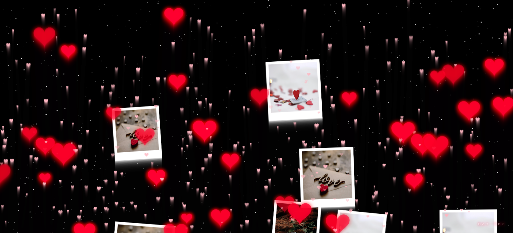

# Love - May-Tec - Maicol Mendoza❤️

**Love** es una experiencia web interactiva que combina música, animaciones visuales y letras tipo karaoke. Ideal para presentaciones románticas y creativas.

---

## 🎵 Características principales

- Botón interactivo para iniciar la experiencia: **“Nuestra Historia Comienza Aquí ❤️”**.  
- Reproducción de la canción (`cancion.mp3`) con letra sincronizada.  
- Letras que suben desde abajo tipo **scrolling vertical**, desapareciendo al llegar arriba.  
- Animaciones de:
  - Corazones flotando  
  - Estrellas parpadeantes  
  - Fotos flotando suavemente  
- Diseño neón y efectos de sombras para estilo moderno.  
- Totalmente compatible con navegadores modernos.

---

## 🎬 Vista previa
 
*Ejemplo de la animación de letras subiendo con corazones y estrellas.*

  
*Botón interactivo para comenzar la experiencia.*

---

## 💻 Cómo usar

1. Descarga o clona este repositorio.  
2. Coloca tus imágenes en la carpeta principal:
   - `foto1.jpg`  
   - `foto2.jpg`  
   - `foto3.jpg`  
3. Coloca tu canción en formato `.mp3` y nómbrala `cancion.mp3`.  
4. Abre `index.html` en un navegador.  
5. Presiona el botón para comenzar y disfruta de la experiencia.

---

## ⚙️ Requisitos

- Navegador moderno (Chrome, Firefox, Edge, Safari).  
- Archivos de imágenes y música correctamente ubicados.  
- Conexión para cargar Google Fonts.

---

## 🛠️ Personalización

- **Cambiar canción:** reemplaza `cancion.mp3`.  
- **Cambiar fotos:** reemplaza `foto1.jpg`, `foto2.jpg`, `foto3.jpg`.  
- **Modificar letras:** ajusta el array `myLyrics` en el `script` para cambiar el contenido y tiempos.  
- **Velocidad de letras:** ajusta los tiempos de la animación en el CSS o en la función `spawnLyric` para hacerlas más rápidas o más lentas.  
- **Cantidad de animaciones:** modifica los bucles de inicialización (`for`) para corazones, estrellas y fotos.

---

## 👨‍💻 Créditos

- Desarrollado por **May-Tec** - Animaciones creadas con **HTML5 Canvas** y **JavaScript puro** - Fuentes: [Google Fonts – Montserrat](https://fonts.google.com/specimen/Montserrat)  

---

## 📄 Licencia

Este proyecto es **libre de uso** para fines personales y educativos. Para uso comercial, contactar al autor.

---

## 📌 Nota

Para ver la experiencia completa, abre `index.html` en un navegador. GitHub o los previsualizadores de Markdown no pueden ejecutar la animación de canvas ni el audio.#
